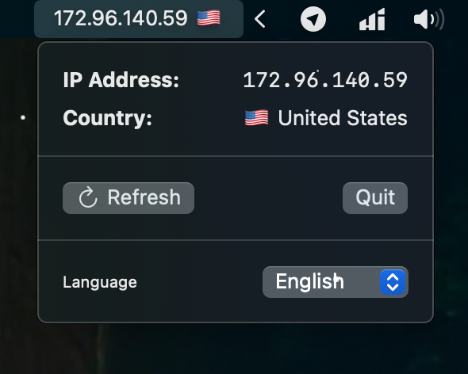
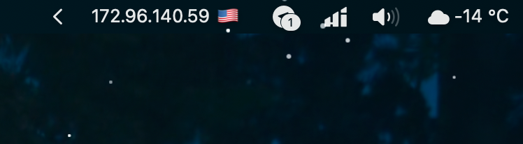

# MenuBarIP


### **[English](#description)** | **[Русский](#описание)**

Простое macOS приложение для отображения вашего IP-адреса и геолокации в строке меню.
Simple macOS application to display your IP address and geolocation in the menu bar.

## Description

MenuBarIP is a lightweight macOS application that displays your current IP address and country flag directly in the menu bar. The app uses multiple API sources for reliable IP address and geolocation detection.



## Features

- **Display IP address and country flag** in the menu bar
- **Automatic refresh** every hour
- **Refresh on click** on the menu bar icon
- **Result caching** for 1 hour
- **Reliability through quorum** — uses 3 API sources for accurate detection
- **Multilingual** — Russian and English support
- **Auto-refresh on network changes** — updates when Wi-Fi, VPN, etc. connect/disconnect



## Requirements

- macOS 13.0+ (Ventura or newer)
- Xcode 14.0+ (for building)

## Installation (Build from Source)

1. Clone the repository:
```bash
git clone https://github.com/aleksandr-440/MenuBarIP.git
cd MenuBarIP
```
2. Open the project in Xcode:
```bash
open MenuBarIPApp.xcodeproj
```

3. Build and run the project (⌘R)

4. The app will appear in the menu bar


## Usage

- **View information**: Click the icon in the menu bar to open the context menu with details
- **Refresh**: Click the "Refresh" button in the menu
- **Automatic refresh**: Data is automatically updated every hour
- **Change language**: Select language at the bottom of the menu (Русский/English)
- **Refresh on network changes**: The app automatically updates IP when network connects/disconnects

## Technical Details

### Architecture

The app is built on SwiftUI using `MenuBarExtra` for integration into the macOS menu bar.

### API Sources

The app uses three API sources for IP address and geolocation detection:

- [ipify.org](https://api.ipify.org/) — IP address detection
- [ipapi.co](https://ipapi.co/) — IP address and geolocation
- [ipinfo.io](https://ipinfo.io/) — IP address and geolocation

### Quorum Logic

For reliability, the app uses quorum logic: IP address and country are determined by majority (2 out of 3 sources must match). If quorum is not reached, the 🏴‍☠️ flag is displayed.

### Caching

Results are cached for 1 hour in the app's memory. The cache is automatically cleared when time expires or on forced refresh.

### Network Monitoring

The app uses Network framework to monitor network connection changes. When an active connection is detected (Wi-Fi, VPN, modem connection, etc.), IP address refresh is automatically triggered.

## Project Structure

```
MenuBarIPApp/
├── MenuBarIPApp.swift      # App entry point
├── ContentView.swift       # Context menu UI
├── IPViewModel.swift       # ViewModel with business logic
├── IPService.swift         # API service
├── QuorumResolver.swift    # Quorum resolution logic
├── CacheManager.swift      # Cache management
├── CountryFlagMapper.swift # Country code to emoji
├── Localization.swift      # Localization system
└── Models.swift            # Data models
```

## Описание

MenuBarIP — это легковесное приложение для macOS, которое показывает ваш текущий IP-адрес и флаг страны прямо в строке меню. Приложение использует несколько API источников для надежного определения IP-адреса и геолокации.

## Возможности

- 🌐 **Отображение IP-адреса и флага страны** в строке меню
- 🔄 **Автоматическое обновление** каждый час
- 👆 **Обновление по клику** на иконку в строке меню
- 💾 **Кэширование результатов** на 1 час
- 🛡️ **Надежность через кворум** — использует 3 API источника для точного определения
- 🌍 **Многоязычность** — поддержка русского и английского языков
- 📡 **Автоматическое обновление при сетевых изменениях** — обновление при подключении/отключении Wi-Fi, VPN и т.д.

## Требования 

- macOS 13.0+ (Ventura или новее / or newer)
- Xcode 14.0+ (для сборки / for building)

## Установка (Сборка из исходников)

1. Клонируйте репозиторий:
```bash
git clone https://github.com/aleksandr-440/MenuBarIP.git
cd MenuBarIP
```

2. Откройте проект в Xcode:
```bash
open MenuBarIPApp.xcodeproj
```

3. Соберите и запустите проект (⌘R)

4. Приложение появится в строке меню

## Использование

- **Просмотр информации**: Кликните на иконку в строке меню, чтобы открыть контекстное меню с деталями
- **Обновление**: Нажмите кнопку "Обновить" в меню
- **Автоматическое обновление**: Данные обновляются автоматически каждый час
- **Смена языка**: Выберите язык в нижней части меню (Русский/English)
- **Обновление при сетевых изменениях**: Приложение автоматически обновляет IP при подключении/отключении сети

## Технические детали

### Архитектура

Приложение построено на SwiftUI с использованием `MenuBarExtra` для интеграции в строку меню macOS.

### API Источники

Приложение использует три API источника для определения IP-адреса и геолокации:

- [ipify.org](https://api.ipify.org/) — определение IP-адреса
- [ipapi.co](https://ipapi.co/) — IP-адрес и геолокация
- [ipinfo.io](https://ipinfo.io/) — IP-адрес и геолокация

### Логика кворума

Для обеспечения надежности приложение использует логику кворума: IP-адрес и страна определяются по большинству (2 из 3 источников должны совпадать). Если кворум не достигнут, отображается флаг 🏴‍☠️.

### Кэширование

Результаты кэшируются на 1 час в памяти приложения. Кэш автоматически сбрасывается при истечении времени или при принудительном обновлении.

### Мониторинг сети

Приложение использует Network framework для мониторинга изменений сетевого подключения. При обнаружении активного соединения (подключение Wi-Fi, VPN, модема и т.д.) автоматически запускается обновление IP-адреса.

## Структура проекта

```
MenuBarIPApp/
├── MenuBarIPApp.swift      # Точка входа приложения / App entry point
├── ContentView.swift       # UI контекстного меню / Context menu UI
├── IPViewModel.swift       # ViewModel с бизнес-логикой / ViewModel with business logic
├── IPService.swift         # Сервис для работы с API / API service
├── QuorumResolver.swift    # Логика определения по кворуму / Quorum resolution logic
├── CacheManager.swift      # Управление кэшем / Cache management
├── CountryFlagMapper.swift # Преобразование кода страны в emoji / Country code to emoji
├── Localization.swift      # Система локализации / Localization system
└── Models.swift            # Модели данных / Data models
```
